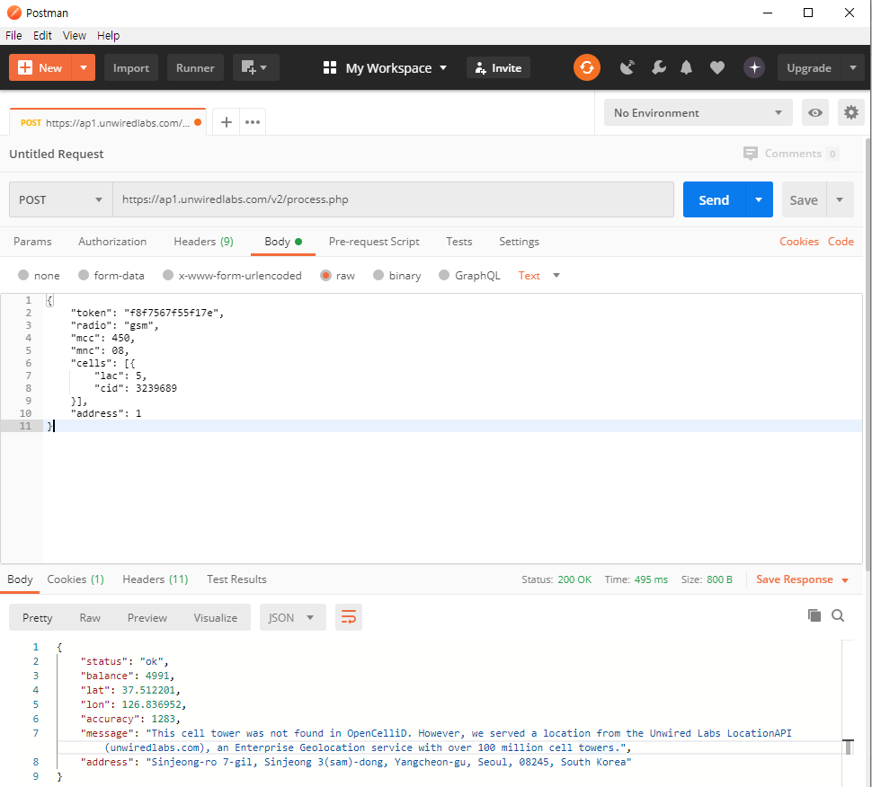
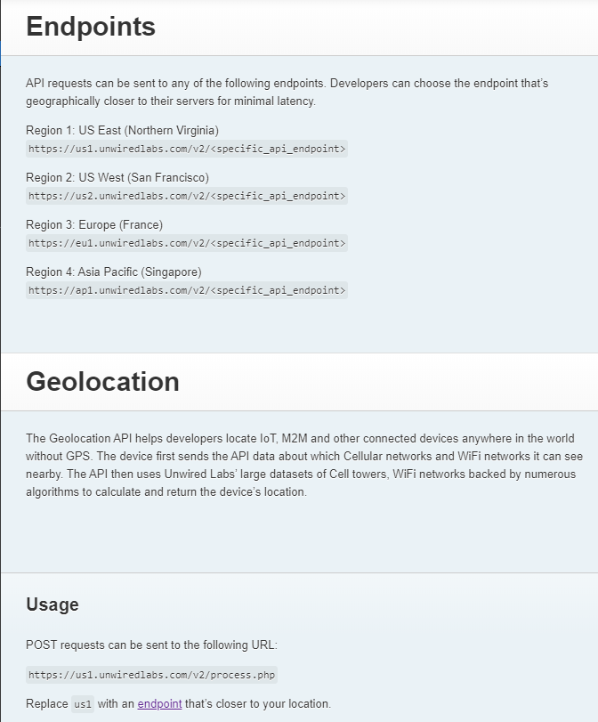
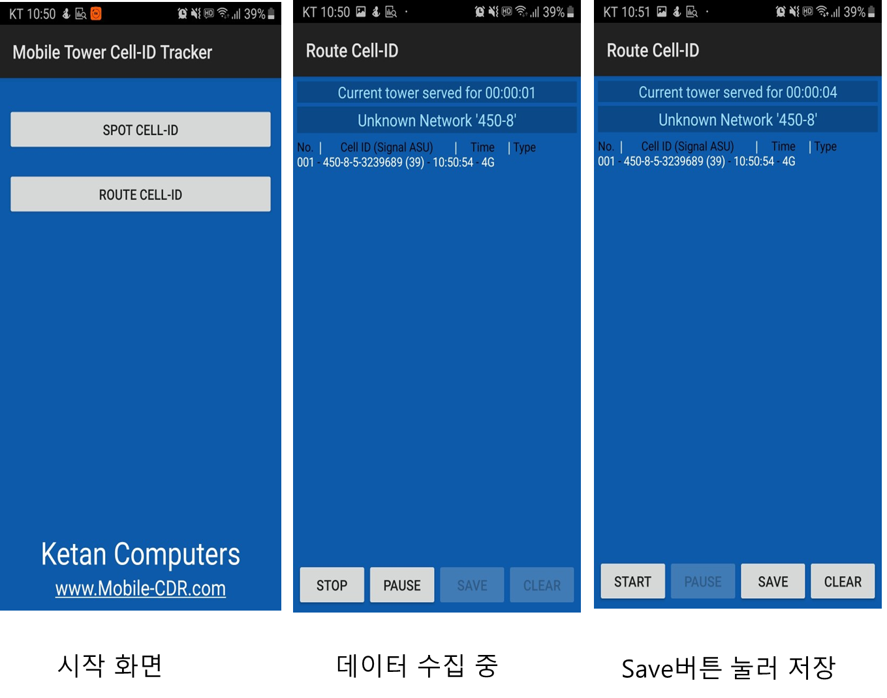

### 실험 과정 및 결과
* 재연한 논문 설명\
이번 실험의 과제는 참고논문 실험을 재연해 보고, 개선점에 대한 아이디어를 도출하는 것입니다.
제가 선정한 참고 논문 A는 "위치기반서비스의 측위시스템 정확도 향상에 관한 연구 분석"([논문 원본 링크](http://www.dbpia.co.kr/journal/articleDetail?nodeId=NODE02500799))이고 교수님께서 함께 분석하라고 하신 논문B는 DeepPositioning:  Intelligent Fusion of Pervasive Magnetic Field and WiFi Fingerprinting for Smartphone Indoor Localization via Deep Learning 분석([논문 원본 링크](https://ieeexplore.ieee.org/document/8260607))
입니다. 
** B논문으로 재연하지 못한 이유
1. B논문으로 재연 하려 시도하였지만 필요한 API, 하드웨어가 혼자서 감당할 수 없는 규모이기 때문이다. \n
2. 제가 초점을 두고 연구하고 싶었던 주제는 WIFI 모듈이나 GPS가 없는 이동통신단말기 (ex: 휴대용 라우터,2G휴대폰)의 Positioning 이였는데 이 논문은 WIFI 모듈이 있는 스마트폰의 실내 측위관련 논문이였다. 
위와 같은 2가지 이유로 B논문에 대해서는 실험 재연은 하지 못하고 이 논문을 이해하고 심층 분석하는 단계에 까지 도달하였다. 
* 실험 한 내용
A논문의 경우 구체적인 해결방법은 없지만 지금까지 측위 방법들에 대해 설명되어 있어 이를 재연하려고 하였다. 
이 논문에서 소개한 TOA,AOA,DTOA,RSSI,기타(Cell-ID,WiFi, NCF)를 이용한 방법들에 대해 심층 분석을 진행한 결과 TOA,AOA,DTOA,RSSI 방법들은 별도의 장비가 필요하거나 현재 이동통신사 들에서 실제로는 쓰지 않는 방법들이 였다.

현재 이동통신사에서 실제 쓰는 위치 추적 방법은 Cell-ID를 이용해 서비스하고 있다는 것을 알게되었다.
그래서 이번 실험은 실제쓰고 있는 Cell-ID위치 추적을 재연해 보았다. 

### 실험 환경

* 실험은 Android 9 시스템이 설치된 Sumsung SM-J730K(Galaxy J7) 모델 스마트폰을 이용하여 진행되었다.
* cell id와 신호세기 측정을 위해 "Mobile tower cell id tracker"어플리케이션을 사용하였다.[그림1]
* 셀 database는 opencellid.org를 [링크](http://opencellid.org) 사용 하였다. 
* 실험장소는 37°30'54.4"N 126°49'59.9"E 로부터 37.513595, 126.855636까지 왕복5.4km를 일정속도로 걸어서 이동하면서 cell id 와 signal 수집하였다.

수집된 정보로 Cell based location detection 방법을 적용해 이동 경로를 구한다음 실제 경로와의 차이를 관찰하였다. 

   

 cell id 로 부터 위치를 얻기 위해 opencell ID 플랫폼을 사용하였다.([Opencell ID 링크](https://opencellid.org))

 개인 키를 발급받고 post방식으로 호출하면 위치 정보를 json 파일 형태로 리턴한다.
   
  
 
 

 

("Network Info","Network Cell Info Lite"어플리 케이션을 사용하여 데이터 수집 시도했지만 수집된 정보를 엑셀 형태로 저장하는 기능이 없어 최종사용하지 않았다.)

