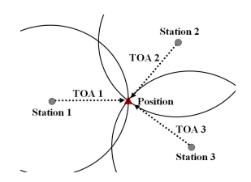

## GPS가 없는 이동 통신 단말기 위치 추적 

GPS가 없이 이동통신 단말기의 위치를 찾는 문제에는 완벽한 해결 방법이 없다.
또 이 문제를 원만히 푸는 것이 필요한 대표적인 3가지 분야를 정리해 보았다. 
   * GPS가 탑재되지 않은 단말기를 사용하는 노인이나 어린이의 실종시 구조를 위한 위치 추적
   * GPS가 작동하지 않는 실내에서 측위가 필요할때
   * 휴대용 라우터 분실시 위치 추적(3G WCDMA·CDMA2000 / 4G LTE·WiBro 등의 이동통신망 신호를 Wi-Fi나 블루투스로 변환해 주는 라우터,한국에서 에그, 포켓파이로 불림)
### 위와 같은 필요성에 측위 시스템 정확도 향상에 관련 연구를 하게 되었다. 
* 참고 논문으로 아래 두개의 논문을 분석해 보았다. 
  * 위치기반서비스의 측위시스템 정확도 향상에 관한 연구
    * 이 논문은 뚜렷한 문제 해결 방법은 없지만 지금까지 나온 위치 측정 방법들에 대해 잘 설명 되어있다.
  * DeepPositioning:  Intelligent Fusion of Pervasive Magnetic Field and WiFi Fingerprinting for Smartphone Indoor Localization via Deep Learning
    * 머신러닝을 이용한 실내측위에 대해 구체적인 방법론이 나와있어 함께 분석 하였다.
### 위치기반서비스의 측위시스템 정확도 향상에 관한 연구 분석([논문 원본 링크](http://www.dbpia.co.kr/journal/articleDetail?nodeId=NODE02500799))

이 논문에서는 아래의 5가지 위치 측위 방법에 대해 설명하였다.
* 전파의 도착 시간(TOA)을 이용하는 방법
  전파의 도착시간을 이용하는 기법은 기준국에서 수신기까지 전파의 도착시간을 이용하여 거리를 계산하고 
  3개 이상의 기준국으로부터 거리를 계산함으로써 3개의 위치선을 이용하여 위치를 계산하는 것으로 삼각측량법에 의한 것이다.
  
  
  전파의 도착시간을 이용하는 대표적인 방법은 위성을 이용하는 것으로 미국의 GPS, 러시아의 GLONASS(GLObal NAvigation Satellite System), 개발 중에 있는 EU의 GALILEO와 중국의 COMPASS 등의 GNSS (Global Navigation Satellite System)가 있다.GNSS 기본 원리는 위성으로부터 수신기까지의 의사거리(Pseudorange) 와 위성과 수신기간 실제거리 , 그리고 시계바이어스 오차에 의해서 계산되어진다.위치의 3차원 성분과 시계바이어스 오차를 포함한 네 가지의 미지수를 구하기 위해서 동시에 측정된 4개의 의사거리가 필요하며, 이는 기하학적으로 각 의사거리를 반지름으로 하는 4개의 구면의 접점을 뜻하게 된다.

  
* 전파의 도착 시간차(DTOA)를 이용하는 방법
전파의 도착 시간차를 이용하는 기법은 2개소의 송신국으로부터 전파 신호의 도착시간차를 임의의 지점에서 
관측하면 관측점에서 각 송신국까지의 거리차를 측정한 것이 된다는 원리를 이용한 방식이다.

* 전파의 도달 방위각(AOA)를 이용하는 방법
* 전파 세기(RSSI)를 이용하는 기법
* 기타(Cell-ID,WiFi, NCF)를 이용한 방법
