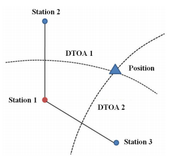

## GPS가 없는 이동 통신 단말기 위치 추적 

GPS가 없이 이동통신 단말기의 위치를 찾는 문제에는 완벽한 해결 방법이 없다.
또 이 문제를 원만히 푸는 것이 필요한 대표적인 2가지 분야를 정리해 보았다. 
   * GPS와 wifi모듈이 탑재되지 않은 단말기를 사용하는 노인이나 어린이의 실종시 구조를 위한 위치 추적
   * 휴대용 라우터 분실시 위치 추적(3G WCDMA·CDMA2000 / 4G LTE·WiBro 등의 이동통신망 신호를 Wi-Fi나 블루투스로 변환해 주는 라우터,한국에서 에그, 포켓파이로 불림)
### 위와 같은 필요성에 측위 시스템 정확도 향상에 관련 연구를 하게 되었다. 
* 참고 논문으로 아래 두개의 논문을 분석해 보았다. 
 * DeepPositioning:  Intelligent Fusion of Pervasive Magnetic Field and WiFi Fingerprinting for Smartphone Indoor Localization via Deep Learning
    * 머신러닝을 이용한 실내측위에 대해 구체적인 방법론이 나와있어 함께 분석 하였다.
  * 위치기반서비스의 측위시스템 정확도 향상에 관한 연구
    * 이 논문은 뚜렷한 문제 해결 방법은 없지만 지금까지 나온 위치 측정 방법들에 대해 잘 설명 되어있다.
 
### DeepPositioning:  Intelligent Fusion of Pervasive Magnetic Field and WiFi Fingerprinting for Smartphone Indoor Localization via Deep Learning 분석([논문 원본 링크](https://ieeexplore.ieee.org/document/8260607))

이 논문은 크게  Introduction,Related work,The DeepPositioning System(제안하는 방법 소개),Experiment Validation(셀제 환경에서 실험 과정), 결론 등 5개의 부분으로 나누어 볼 수 있다. 

#### Introduction 
이 논문에서는 딥러닝을 이용한 위치 측위 시스템을 제안하였다. 지금 까지는 실내에 WIFI가 널리 보급되었기 때문에 대부분의 스마트폰 실내 측위 시스템은 와이파이 위치탐지를 기반으로 하였다. DeepPositioning은 오프라인 학습 단계와 온라인 서비스 단계로 구성되어 있다. 오프라인 학습 단계에서는 스마트폰으로 보다 구체적인 지도특징정보를 딥러닝 기법으로 추출한다. 오프라인 단계는 주로 사전 설정된 기준 위치의 조사 데이터를 수집하고 사전 처리하여 데이터베이스 구축을 위한 것이다.

#### Related work 
실내 측위 시스템은 완벽한 해결책이 없는 어려운 문제이다. 지금까지 다양한 방법들이 실내 측위에 사용되었다. 실례로 블루투스, 초음파 또는 음파기술, 빛 모션 센서 등 다양한 방법들이 사용되었다. 이 중 몇가지 방법은 오차 수 Cm밖에 되지 않아 정확도가 높다. 실례로 어떤 시스템은 사무실이나 교실환경에서 6~25cm정도의 정확도를 나타냈다. 그러나 이러한 방법들은 추가 인프라가 요구된다. wifi를 이용한 경우 추가 인트라 설치 비용없이 실내 측위 시스템을 구현할 수 있다. 

wifi 신호 처리 방식에 따라 wifi 기반 접근 방식은 AOA, TOA or DTOA, fingerprinting approaches로 나누어 볼 수 있다. 
(fingerprinting approaches 를 번역하기 애매하며 wifi지도법 이라고 하였다.)
wifi지도법은  관측 값과 미리 기록된 건물내부DB 값과 비교하는데 초첨을 둔다.
좀 더 구체적으로 wifi 지도법은 오프라인, 온라인 두가지 단계로 나누어 볼 수 있다.
전통적인 방법은 수동적인 데이터 분석, 정확한 위치 기록을 만들기위한 시간이 요구된다.  이러한 방버들은 큰 빌딩이나 다량의 데이터에는 적용하기 어렵다. 머신러닝 방법은 wifi지도를 train하는데 사용된다. 최근 deep learning을 활용한 실내 측위 정확도를 높이기 위한 다양한 방법들이 발표 되었다. 

#### 본 논문에서 제안한 방법(The DeepPositioning System)

지금 부터 이 논문에서 제안한 the DeepPositioning system을 설명하려고 한다. 시스템 흐르음 아래 그림과 같다. 
 

이 시스템은 이미 존재하는 APs를 제외한 어떤 인프라도 필요하지 않다. 또란 AP위치에 대한 사전 요구 사항도 없다.AP위치 정보는 상업용 또는 정부 건물의 경우 사용이 불가한 경우도 있었다. 

위치 추정은 오프라인 학습 단계와 온라인 서비스 단계로 나뉜다. 오프라인 단계에서는 모든 RP 데이터를 모바일 디바이스에 저장한다.RSSI와 자기 값은 수집되어 서버에 저장 된다. 다양한 지도 정보를 모은다음 서버는 RSSI와 자기 정보를 딥러닝 입력 데이터의 요구에 맞게 전처리 한다. 거의 모든 스마트폰은 무선 네트워크 장비와 가속계,카메라,마이크등과 같은 다양한 센서가 부착되어 있다. 

스마트폰의 다양한 센서로부터 와이파이 네트워크 정보를 얻는 것은 어렵지 않다. 

* WIFI data
wifi를 스캔하면 네트워크의 이름, 맥주소, 신호세기등을 얻을 수 있다. 
* Magnetic data
자기 정보는 3차원 벡터로 표현된다. 오프라인 학습 단계에서 장치의 회전을 제어할 수 있지만 온라인 서비스 단계에서는 그렇지 않다. 
 

### 위치기반서비스의 측위시스템 정확도 향상에 관한 연구 분석([논문 원본 링크](http://www.dbpia.co.kr/journal/articleDetail?nodeId=NODE02500799))

이 논문에서는 아래의 5가지 위치 측위 방법에 대해 설명하였다.
* 전파의 도착 시간(TOA)을 이용하는 방법
  전파의 도착시간을 이용하는 기법은 기준국에서 수신기까지 전파의 도착시간을 이용하여 거리를 계산하고 3개 이상의 기준국으로부터 거리를 계산함으로써 3개의 위치선을 이용하여 위치를 계산하는 것으로 삼각측량법에 의한 것이다.
  
  
전파의 도착시간을 이용하는 대표적인 방법은 위성을 이용하는 것으로 미국의 GPS, 러시아의 GLONASS(GLObal NAvigation Satellite System), 개발 중    에 있는 EU의 GALILEO와 중국의 COMPASS 등의 GNSS (Global Navigation Satellite System)가 있다.GNSS 기본 원리는 위성으로부터 수신기까지의 의사  거리(Pseudorange) 와 위성과 수신기간 실제거리 , 그리고 시계바이어스 오차에 의해서 계산되어진다.위치의 3차원 성분과 시계바이어스 오차를 포함한 네 가지의 미지수를 구하기 위해서 동시에 측정된 4개의 의사거리가 필요하며, 이는 기하학적으로 각 의사거리를 반지름으로 하는 4개의 구면의 접점을 뜻하게 된다.

  
* 전파의 도착 시간차(DTOA)를 이용하는 방법
전파의 도착 시간차를 이용하는 기법은 2개소의 송신국으로부터 전파 신호의 도착시간차를 임의의 지점에서 관측하면 관측점에서 각 송신국까지의 거리차를 측정한 것이 된다는 원리를 이용한 방식이다.

한 쌍의 두 국에 대하여 전파의 도착시간차, 관측거리차를 갖는 점의 궤적은 쌍곡선 형태의 위치선이 된다. 그리고 2개 이상의 위치선의 교점은 관측자의 위치가 된다. 이 방법의 정밀도는 대략적으로 수백 m의 오차를 포함하고 있다.전파의 도착시간차를 이용하는 대표적인 방법이 쌍곡선 항법체계인 로란, 오메가, 데카 항법이다. 이러한 항법시스템들은 GNSS의 등장으로 사향 길로 접어들었으나 최근 GNSS 취약점이 부각되면서 다시 백업시스템으로 대두되며 TOA 개념을 도입한 eLoran으로 재등장하고 있다.

* 전파의 도달 방위각(AOA)를 이용하는 방법
전파의 도달 방위각을 이용하는 기법은 이용자가 무선방위측정기를 이용하여 전파의 도래 방위각을 측정한다. 무선방위측정기는 루프 안테나를 이용하여 수신
된 방위를 아는 방식으로 원리는 그림 4와 같다.전파의 도달 방위각을 이용하는 대표적인 시스템은 항공의 ILS(Instrument Landing System), 해상의 RDF 
(Radio Direction Finder) 등이 있다.

* 전파 세기(RSSI)를 이용하는 기법
  전파의 세기를 이용하는 방법은 자유공간 상에서 감쇄되는 정도에 따라 거리를 측정하는 방법으로 전파되는 송신 신호의 감쇄(a)는 식 2와 같으며 송신신호와 수신 신호의 비율로 구할 수 있다. 여기에서 λ는 사용 주파수, R은 거리, c는 전파의 속도를 나타낸다.\
  a=20log(4*pi*R/λ)   (2)\
  전파의 세기를 이용하여 측정된 거리가 하나의 위치선이 되며 위치선이 3개 이상 측정되면 삼각측량법에 의해 위치를 계산할 수 있다. 대표적인 방법이 핸드폰 기지국을 이용하는 것이나 Bluetooth를 이용하는 것이다. 
  

  
  * 기타(Cell-ID,WiFi, NCF)를 이용한 방법
이 외에도 실내 또는 전파 수신이 잘 안 되는 곳에서 위치 측정을 위해 휴대폰 기지국 Cell-ID를 이용하거나 Wi-Fi 등을 이용한 무선랜(WLAN; Wireless Local Area Network), 근거리 통신망인 NCF나 UWB(Ultra Wide Band)를 이용한 방법 들이 있다.
#### 위치 측정 결과 분석

표에서와 같인 GPS가 없으면 정확도가 현저히 떨어지는 것을 알 수 있다. 

